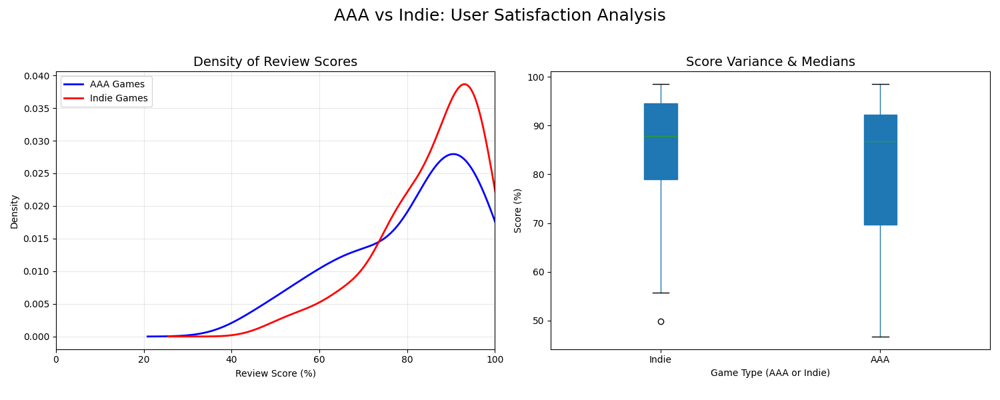

# AAA vs Indie - User Review Score - Statistical Analysis 

The video game industry can be divided into two categories: *AAA* games and *Indie* games.
*AAA* games are backed by large studios and substantial budgets, whereas *Indie* games are
backed by passion and small teams. The main objective of this project is to determine
whether *Indie* games achieve user satisfaction scores comparable to *AAA* games.

This project was done as part of MA2041 - Probability and Statistics Course

`Sathish K`
`112401032`
